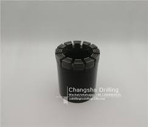

#+title: Drilling
#+options: num:nil author:nil timestamp:nil date:nil
#+setupfile: https://fniessen.github.io/org-html-themes/org/theme-readtheorg.setup

In the oil and gas industry, a drill bit is a tool designed to produce a generally cylindrical hole (wellbore) in the Earth’s crust by the rotary drilling method for the discovery and extraction of hydrocarbons such as crude oil and natural gas. This type of tool is alternately referred to as a rock bit, or simply a bit.

#+ATTR_HTML: :width 300px

* Notes

*RC Drilling*: 124-130mm with protuding metal buttons or pins.
*Core Drilling* 63mm

*Core*: Provides geologist with the opportunity to analyze samples
