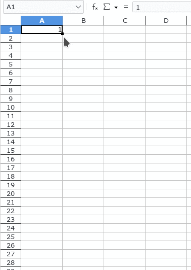
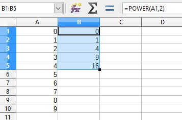

:PROPERTIES:
:ID:       18d57b7d-519f-42d6-beb0-b086b61a860a
:ROAM_ALIASES: LIBREOFFICE
:END:
#+title: LibreOffice

-> [[id:9be91f09-e446-4d22-931e-c05792d8f582][SYSAPPS アプリ]]

[[][github page] ]
[[https://www.libreoffice.org/][main page]]
[[][gentoo wiki] ]
[[][arch wiki] ]

* RESOURCES
* package

arch -> ...
gentoo -> ...
nixos -> ...

* usage
* configuration

*DISABLING*
Disable certain stuff by clicking on:
-> Tools
-> AutoCorrect Options
-> Options

Now, you can disable the entire of AutoCorrect in:
-> Tools
-> click on the /AutoInput/ checkbox

*TEXT ON THE RIGHT SIDE OF THE CELL*
You can align text to always start on the left with:

** deleting the saved config

The configuration for LibreOffice is located at:
~~/.config/libreoffice/4~

In case of wanting to start the configuration again, just delete it.

** dark mode

[[https://itsfoss.com/libreoffice-dark-mode/][How to Go Full Dark Mode With LibreOffice - IT'S FOSS]]
[[https://www.debugpoint.com/how-to-enable-dark-mode-libreoffice/][How to Enable 'Dark Mode' in LibreOffice - debugpoint.com]]

While GNOME has a setting you can enable for dark mode, in the case of Window Managers like Hyprland or Xmonad, you will have to use a GTK theme.

Once you get it running, LibreOffice should automatically pick up the theme, except it wont apply it completely. You will have to do some tweaks in configuration.

+ choosing a good icon theme

_tip_: for *LibreOffice Calc* change the _Grid Lines_

* CALC
** KEYBINDINGS

~Ctrl + arrow keys~
+ ~up~ -> move to starting or current row
+ ~down~ -> move to last or current row
+ ~left~ -> move to current or first column (left)
+ ~right~ -> move to current or last column (right)

~Shift + arrow keys~ -> select more boxes
~Alt + left / right arrows~ -> resize boxes

on the FIRST CELL, type ~C1:C30000~ an press Enter.
All 30000 rows will get selected
Type ~Ctrl + d~ and the text or formula in the first one will be applied to all

~Ctrl + Shift + Arrow Keys~ -> Go to first block, last of list, or last block in rows / columns.

** TIPS
*** Replace a string with empty space
*** Delete empty blocks between blocks
*** Make a number column automatically

Just click and drag on that little dot in the left down corner of the number.

This also works for numbers within a String, such as
~DDS_NUMBER-001~
~DDS_NUMBER_002~
or also on ones that already are counting
~PKG_NUMBER-025~
~PKG_NUMBER-026~
and so forth...

_fix to do_: Be careful when you have a string like ~-000~ as when expanding it, it will change the dash (-) into a plus (+) symbol.
But if you manually input ~-001~ then expand it, it will work as normal, i.e ~-002~, ~-003~...

*** Invisible character

[[https://www.editpad.org/tool/invisible-character][Invisible Character - Editpad]]

The forms are listed by default, that's why you can use a *invisible character* so you don't put a list again on the *name* column.

this is a normal space -> " "
this is the invisible character -> "‎"

*** Changing case of text in Calc

[[https://www.libreofficehelp.com/change-capitalization-case-libreoffice-calc][source]]

Change to *UPPER CASE*
#+begin_src csv
=UPPER(text)
#+end_src

Change to *lower case*
#+begin_src csv
=LOWER(text)
#+end_src

Change to *Title Case*
#+begin_src csv
=PROPER(text)
#+end_src

*** Applying functions to columns

[[https://superuser.com/questions/1236149/libreoffice-calc-how-to-apply-functions-to-columns][LibreOffice Calc: How to apply functions to columns? - StackExchange]]

You need to drag on the small box in the *lower right hand corner* and _drag down_.

*** Copying a function

As functions are attached to a column, they will not work if the original column gets deleted.

Now, what if you have a converted text 

*** Borders

Whenever you copy from a file that has borders, the borders will also be copied.
You can disable them by
+ Select the boxes
+ Go into *Borders (shift to overwrite)*

  [[img...

+ Select the first option, *No Borders*

*** Filtering

+ Do a click on the empty space between *A* and *1*.

+ Click into the *AutoFilter* (Ctrl + Shift + L) Option

  [[img...

+ Now, on the first row you should see little boxes, this ones will let you filter by different variables like:
  - Sort Ascending: by
  - Sort Descending: by

+ You can have your own simple filter there

*** How to change the date format

Highlight all or range, then use
- Format Cells
- Numbers [tab]
- choose "Date" under "Category" list
- In the "Format code" box, you can change it or choose another convention
- Save "OK"

** CONFIGURATION
*** ROW BLOCK HEIGHT

- *Right Click* on the row you want to edit (single), or select multiple rows to edit, or edit all rows.
- *Row Height* -> Select your prefered height and click *OK*.

Changing the measure:
