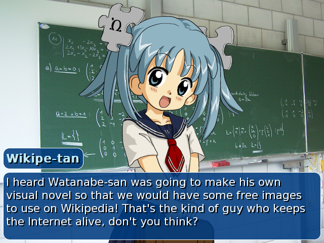

:PROPERTIES:
:ID:       83850e1f-4f0b-4426-8ec6-403940630095
:ROAM_ALIASES: "VISUAL NOVELS" VN "VISUAL NOVEL" ビジュアルノベル
:END:
#+title: Visual Novel

-> [[id:050e9166-394b-40bb-8135-a45ab4419153][MAIN メイン]] -> [[id:a1f856a6-a6bf-4412-b9b3-52db03710620][GUIDES ガイド]] -> [[id:820af444-d90f-44e4-8723-c4d6e82b42b5][EMULATION]]

[[https://en.wikipedia.org/wiki/Visual_novel][wikipedia page - en]]
[[https://ja.wikipedia.org/wiki/%E3%83%93%E3%82%B8%E3%83%A5%E3%82%A2%E3%83%AB%E3%83%8E%E3%83%99%E3%83%AB][wikipedia page - jp]]

#+ATTR_HTML: width 300px

* VN LIST

リンク
[[https://tss.asenheim.org][Nostalgic Visual Novels on-line]]

[[https://anacreondjt.gitlab.io/vn-chart][DJT's Anacreon - Visual Novel Chart By Difficulty]]
[[https://docs.google.com/document/d/1KnyyDt7jimEz-dgeMSKymRaT2r3QKBPm9AzqZ6oUWAs/pub][List of starter Japanese Media - google docs]]

[[https://learnjapanese.moe/vn][Visual Novel Guide - TheMoeWay]]

読んだ
- Saya no Uta
- Kimi to Kanojo to Kanojo no Koi (totono)
- Doki Doki Literature Club

優しい
- [[https://vndb.org/v310][Nursery☆Rhyme]]
- [[https://vndb.org/v18][To Heart]]
- [[https://vndb.org/v177][Comic Party]]

- [[https://vndb.org/v5244][Hanahira!]]
- Unred Night

- Azanael
- [[https://vndb.org/v193][Nanatsuiro★Drops]]

- [[https://vndb.org/r73212][Subarashiki Hibi ~Furenzoku Sonzai~]]
- SCIADV SERIES
  - CHAOS;HEAD
    https://twitter.com/CommitteeOf0/status/1621644745570422785?s=20&t=g0LRDUFHt5jGhU9yKSO3hA
- planetarian
- [[https://www.katawa-shoujo.com][Katawa Shoujo]]
- Fullmetal Daemon Muramasa
- zero escape nonary
- danganronpa
- gnosia
- utawarerumono

- tokyo school life
- [[http://www.alcot.biz/product/cld][Clover Days]]
- [[http://www.lumpofsugar.co.jp/product/unmei/unmei][Unmei Senjo No Phi]]
- [[https://vndb.org/v1278][Saihate no Ima]]
- [[https://vndb.org/v8213][DRACU-RIOT!]]
  
- Baldr Sky

- [[https://vndb.org/v8158][Daitoshokan no Hitsujikai]]
- [[https://vndb.org/v7302][Hatsuyuki Sakura]]
- [[https://vndb.org/v3770][Aiyoku no Eustia]]
  

EROGE
- [[https://vndb.org/v2762][Kyonyuu Fantasy]]

STEAM
- WITH JAPANESE OPTION
  - [[https://store.steampowered.com/app/464780/ChuSingura461_S][ChuSingura46+1 S]]
- ONLY ENGLISH TRANSLATION
  - Totono
  - Saya no Uta

** companies

"Something normal and easy."
[[http://www.pulltop.com/adult/index.html][Pull Top main page]]
[[http://toneworks.product.co.jp/product.html][tone work's main page]]

"Often comedy with daily life scenario, easy to read, "get your girl" kind of game."
[[http://www.hook-net.jp/htm/product.htm][Hooksoft/sme main page]]

"And we always have *Keys* works, with emotional plots.
[[https://key.visualarts.gr.jp/product_all][Key main page]]

* WINE/TEXTRACTOR TEST

|-------------------+--------------+----------------------+--------------+------------|
| name              | linux        | textractor/hook code | GDI/GL       | fullscreen |
|-------------------+--------------+----------------------+--------------+------------|
| Nanatsuiro Drops  | Yes          | Yes, kinda weird     | GL           | Weird      |
| Comic Party       | Yes          | Yes                  | GL?          | Weird      |
| Axanael           | Needs fixing | Untested             | Needs fixing | X          |
| FMD               | Yes          | Yes                  | GL?          | Weird      |
| Twinkle Crusaders | Yes          | Yes                  | GDI          | Yes        |
|                   |              |                      |              |            |
|-------------------+--------------+----------------------+--------------+------------|

* VISUAL NOVELS ON LINUX

[[https://learnjapanese.moe/vn-linux][Visual novels on Linux - TheMoeWay]]
[[https://learnjapanese.moe/vn-bsd/][Visual novels on FreeBSD - TheMoeWay]]

[[https://youtu.be/KtiA6GaFIzM][The Definitive Steam Deck Visual Novel Guide - moogul (youtube video)]]
[[https://gist.github.com/eshrh/5bbf4deab58fefdab9eacf77b450efc0][Concise visual novel setup on linux - github gist]]
[[https://www.reddit.com/r/visualnovels/comments/mga4d6/tutorial_how_to_run_any_visual_novel_on_linux][[tutorial] How to run any visual novel on Linux (pretty much) - reddit post]]
[[https://fglt.nl/guides/visual-novels-on-gnu-linux.html][Playing Visual Novels on GNU/Linux with Wine - FGLT]]

** ENABLE JAPANESE LOCALE

_note_: Enable the Japanese Locale in your system.
- Edit ~/etc/locale.gen~
- Uncomment the line ~jp_JP-UTF-8~
- Regenerate the locales: ~# locale-gen~
Now you can run a japanese locale on applications using:
~$ LANG="ja_JP.UTF-8" ...~

** CREATE A NEW WINE PREFIX

Here's how to create a wine prefix, we will make a 32bit one.
_note_: If not specifying a prefix, it takes the default of ~~/.wine~
~$ WINEPREFIX=~/wine/pfx32 WINEARCH=win32 wineboot~

In case of a 64bit
~$ WINEPREFIX=~/wine/pfx32 WINEARCH=win64 wineboot~

** CONFIGURING WINE PREFIX

winetricks fontsmooth=rgb
mimeassoc=off
regedit

_FROM THEMOEWAY_
~$ WINEPREFIX=~/wine/pfx32 winetricks -q dotnet35 vcrun2003 vcrun2005 vcrun2008 vcrun2008 vcrun2010 vcrun2012 vcrun2013 vcrun2015 lavfilters alldlls=default quartz dxvk~

Now, install *Windows Media Player 10*, which is not easy to uninstall, copy your prefix just in case.
~$ WINEPREFIX=~/wine/pfx32 winetricks -q wmp10~

_FROM THE REDDIT POST / GITHUB GIST_
~$ WINEPREFIX=~/wine/pfx32 winetricks d3dx9 dirac dotnet35 dotnet40 dxvk lavfilters vcrun2003 vcrun2005 vcrun2008 wmp9~

Get around issues with cinematics changing the renderer to GDI.
~$ WINEPREFIX=~/wine/pfx32 winetricks renderer=gdi~
_note_: In case with problems with cinematics with GDI, change to gl.
~$ WINEPREFIX=~/wine/pfx32 winetricks renderer=gl~

You can also set windows version to 7 or 10.
~$ WINEPREFIX=~/wine/pfx32 winecfg~

*** JAPANESE FONTS

*FONT PACK*
[[https://drive.google.com/file/d/1OiBgAmt3vPRu08gPpxFfzrtDgarBGszK/view?usp=drivesdk][google drive link]]

Unzip and move the font files into ~<prefix>/drive_c/windows/Fonts~
_note_: Prefer this to Winetricks ~cjkfonts~, which don't work properly for VNs.

*Shift-JIS*

** INSTALLING THE VN

*MOUNTING*

A good amount of games will come in ~iso~ format, we will have to extract them first.
_note_: requires p7zip
~$ 7z x <installer>.iso~

If you don't have p7zip or an iso extracting tool:
~$ mkdir ~~/isomount~
~# mount <installer>.iso ~/isomount~
~$ mkdir ~~/games/<game>~
~$ cp -r ~/isomount/* ~/games/<game>~
~$ umount ~/isomount && rm -r ~/isomount~

Install them like you would run a game.
~$ LC_ALL=ja_JP.UTF-8 TZ="Asia/Tokyo" WINEPREFIX=<path> wine <game>.exe~

_note_: try to change folders from japanese to english to prevent errors.

** RUNNING THE VN

Running a game with japanese locale:
~$ LC_ALL=ja_JP.UTF-8 TZ="Asia/Tokyo" WINEPREFIX=<path> wine <game>.exe~

Sometimes your *DE/WM* can mess up with the game's resolution, in this case you can tell wine to _emulate a virtual desktop_:
~$ LC_ALL=ja_JP.UTF-8 TZ="Asia/Tokyo" WINEPREFIX=<path> vd=1920x1080 wine <game>.exe~

You can also enable this setting globally with ~winecfg~
~$ WINEPREFIX=<path> winecfg~
-> *Graphics*
-> *Window settings* -> Check *Emulate a virtual desktop*
-> Specify your virtual desktop resolution. (1280x720, 1920x1080, ...)

try with vulkan/dxvk too
~$ WINEPREFIX=<path> winetricks dxvk~ <- install vulkan

** LUTRIS

Once we can run VNs through wine, we can simplify the process of running them through wine with Lutris, this will give us a nice frontend for all our installed games.

*ADDING A GAME*
- Open lutris and click on the + symbol
- Add locally installed game
- Here
  - *Game info*
    - *Name*: The game name.
    - *Runner*: *Wine (Runs Windows games)*
  - *Game options*
    - *Executable*: The game executable. (game.exe)
    - *Wine prefix*: The Wine prefix.
    - *Prefix architecture*: *32-bit* or *64-bit*, depending on your prefix.
  - *System options*
    - *Enable NVIDIA Primer Render Offload*: If you are on a Optimus laptop, and want to run with GPU.
    - *Game execution* - *Environment variables*: Add the next ones:

      |--------+-------------|
      | Key    | Value       |
      |--------+-------------|
      | ~LC_ALL~ | ~ja_JP.UTF-8~ |
      | ~TZ~     | ~Asia/Tokyo~  |
      |--------+-------------|
- Now click save, and it should be ok to run.

** ADDING A VN TO STEAM

On any VN added to lutris
- Right click on it
- Click on *Create steam shortcut*

_note_: If it doesn't appear on Steam, exit and reopen.

Now you can edit the game's cover art in steam.
[[https://www.steamgriddb.com][SteamGridDB]]

1. Portrait picture
2. Banner picture (aka hero)
3. Logo
4. Mini landscape header picture
5. Icon (optional)

** TIPS
*** CREATING ALIASES [NOT WORKING]

_note_: While the alias of wine is working without any problems, running the soft link of the game exe doesn't work, _looks like a wine problem_.
-> [[https://askubuntu.com/questions/226915/wine-wont-follow-symbolic-links][Wine won't follow Symbolic links - StackExchange]]

-----

If not using Lutris, you can make an alias of the Wine prefix and configuration in ~~/.bashrc~ or ~~/.zshrc~
#+begin_src
alias vn='LC_ALL="ja_JP.UTF-8" TZ="Asia/Tokyo" WINEPREFIX=<path> wine'
alias vn-1080='LC_ALL="ja_JP.UTF-8" TZ="Asia/Tokyo" WINEPREFIX=<path> vd=1920x1080 wine'
#+end_src

And also, try to make a symbolic link of the game's executables.

~$ mkdir games~
~$ ln -s <path/to/game.exe> game.exe~

This way, to play a VN, the only thing you need to do is:
~$ cd games
~$ vn <game>.exe~

*** FIX: FUGURIYA VNS

[[https://cdn.discordapp.com/attachments/813105334763126814/832650409167945798/fjfix.tar.gz][download]]

VNs made by Fuguriya may not launch with Wine by default, fix it with the next steps:

- Extract archive
- Run wine like this
  ~LC_ALL=ja_JP.UTF-8 WINEPREFIX=~/.winevn fjfix.exe -f /path/to/MGD~

*** FIX: GLITCHY VIDEOS

Try running on prefix without ~wmp10~.
Try uninstalling LAVFilters.

Running ~wine control~ can help you uninstall.

*** FIX: SHIFT JIS LOCALE

[[https://cdn.discordapp.com/attachments/813105334763126814/825472692558889022/ja_JP.sjis.zip][download]]

1. Unzip it, and cd into directory.
2. Compile locale with ~localedef~:
   ~$ localedef -i ja_JP -f SHIFT_JIS ./ja_JP.sjis --no-warnings=ascii~
3. Edit your ~/etc/locale.gen~:
   ~$ sed -i '/ja_JP.UTF_8 UTF-8/a ja_JP.SJIS SHIFT_JIS ' /etc/locale.gen~
4. Generate locales:
   ~$ locale-gen~
   

* REVISE - 2

[[https://www.reddit.com/r/visualnovels/comments/mga4d6/tutorial_how_to_run_any_visual_novel_on_linux][How to run any visual novel on Linux (pretty much) - reddit post]]

- Set up japanese locale

running a japanese vn
~$ LANG="ja_JP.UTF-8" wine clannad.exe~

** installing from a iso

_method 1_: mounting and then copying to a folder
1. download the iso
2. mount the iso -> ~mkdir /mnt/iso && mount <file>.iso /mnt/iso~
3. cd into d

_method 2_: using 7zip
extract directly to the folder containing the iso file
~$ 7z x <file>.iso~

_method 3_: using isoinfo (needs cdr
list content of ISO file
~$ isoinfo -i <file>.iso~

extract like this:
~$ isoinfo -i <file>.iso -x MD5SUM.TEXT > MD5SUM.TXT~

** installing the VN

now, having the install executable we can install it into our wine system like this
~$ LC_ALL="ja_JP.UTF-8" TZ="Asia/Tokyo" wine setup.exe~

** running the VN

now you can execute it like this

* REVISE - 1
** learnjapanese.moe -
** installing wine

_note_: *arch linux*
remember to enable [multilib] and [community] if using arch, to do this uncomment the next in ~/etc/pacman.conf~

*arch packages*
yay -S wine-staging winetricks ffmpeg lib32-ffmpeg alsa-plugins lib32-alsa-plugins alsa-lib lib32-alsa-lib libjpeg-turbo lib32-libjpeg-turbo libxcomposite lib32-libxcomposite libxinerama lib32-libgcrypt libgcrypt lib32-libxinerama ocl-icd lib32-ocl-icd libxslt lib32-libxslt libva lib32-libva gst-plugins-base lib32-gst-plugins-base gst-plugins-good lib32-gst-plugins-good gst-plugins-bad lib32-gst-plugins-bad gst-plugins-ugly lib32-gst-plugins-ugly vulkan-icd-loader lib32-vulkan-icd-loader lib32-openssl gst-libav lib32-gst-libav

** installing cdemu

*PACKAGE*
arch -> ~cdemu-client~ ~cdemu-daemon~ ~vhba-module~
gentoo ->
nixos -> ~cdemu-client~ ~cdemu-daemon~

_note_: if using a custom or LTS kernel, do ~vhba-module-dkms~

start the module (non nixos)
~# modprobe -a sg sr_mod vhba~

** creating a wine directory

create a clean 32-bit wine prefix.
_note_: a 64-bit prefix can run 32-bit programs, but there may be unexpected problems (e.g. SafeDisc-protected games only work under 32-bit).
~$ WINEPREFIX=~/.winevn WINEARCH=win32 wineboot~

** configuring wine with winetricks

_note_: enabling *Font smoothing* is optional, but recommended.
~$ WINEPREFIX=~/.winevn winetricks fontsmooth=rgb~

_note_: prevent wine from taking over as the default applications for some file formats.
~$ WINEPREFIX=~/.winevn winetricks mimeassoc=off~

_note_: you can open Registry Editor and import this [[https://cdn.discordapp.com/attachments/813105334763126814/813105422285799464/wine_breeze_colors.reg][reg file]], for a GUI improvement.

update winetricks like this:
~# winetricks --self-update~
(updated by default on NixOS)

1. Now, we can use winetricks.
   ~$ WINEPREFIX=~/.winevn winetricks -q dotnet35 vcrun2003 vcrun2005 vcrun2008 vcrun2010 vcrun2012 vcrun2013 vcrun2015 lavfilters alldlls=default quartz dxvk~

2. Installing Windows Media Player 10 as a next step.
   ~$ WINEPREFIX=~/.winevn winetricks -q wmp10~
   _note_: It's recommended to copy your prefix somewhere else, because wmp is not easy to uninstall.
   ~$ cp ~/.winevn ~/.winevn2~

3. At last, set the rendered to GDI to get around issues with cinematics.
   ~$ WINEPREFIX=~/.winevn winetricks renderer=gdi~
   _note_: GDI option is for legacy purposes, while there is more efficient options, Wine tends to crash or skip videos without alerting you. That's why GDI is being used as the baseline.
   _note_: If you experience any problems like low performance or black screens, change it to
   ~$ winetricks renderer=gl~, and falling back to GDI if you can't progress.

** japanese fonts in Wine

_question_: *Why not install ~cjkfonts~ in winetricks?*
_answer_: *Because it doesn't properly work for VNs.*

1. Download the [[https://drive.google.com/file/d/1OiBgAmt3vPRu08gPpxFfzrtDgarBGszK/view?usp=drivesdk][japanese font pack]]
2. Unzip with ~$ 7z x 'Windows Japanese Fonts.zip'~
3. move the font files to ~Fonts~ folder in ~~/.winevn/drive_c/windows/Fonts~.

** using lutris
