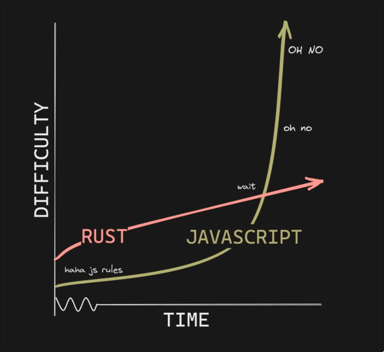

:PROPERTIES:
:ID:       c936b7f7-28f9-4523-b1e3-45c105562b02
:ROAM_ALIASES: RUST
:END:
#+title: Rust

-> [[id:c9156aa2-0d9f-45dd-bf1a-e114e74c13b5][STUDY 勉強]]

[[https://wiki.gentoo.org/wiki/Rust][gentoo wiki]]

* MATERIALS

*BOOKS*
+ [[id:6aaf8199-d884-4cb4-b459-2be02d9918a8][The Rust Programming Language]]
+ [[https://doc.rust-lang.org/book/][The Rust Programming Language - online book]]
+ [[https://doc.rust-lang.org/rust-by-example/][Rust By Example - online book]]
+ Rust For Rustaceans

*GITHUB*
+ [[https://github.com/rust-unofficial/awesome-rust][awesome-rust]]
+ [[https://github.com/rust-lang/rustlings/][rustlings]] (Close to the book)
+ [[https://github.com/0atman/noboilerplate][noboilerplate -> Recommended Rust Reading]]

*YOUTUBE - TUTORIAL*
+ [[https://youtu.be/MsocPEZBd-M][Rust Programming Course for Beginners - Tutorial - freeCodeCamp.org]]
+ [[https://youtu.be/WGWN4St9G-g][A Simple Rust Program for Beginners - Jake Westall]]
+ [[https://youtu.be/784JWR4oxOI][All Rust features explained - Let's Get Rusty]]

*YOUTUBE*
+ [[https://youtu.be/2hXNd6x9sZs][How to Learn Rust - No Boilerplate]]
+ [[https://youtu.be/CJtvnepMVAU][Rust Is Easy - No Boilerplate]]

*OTHER*
+ [[https://rustmagazine.org/][Rust Magazine]]
+ [[https://youtu.be/ycMiMDHopNc][Desktop and editor setup for Rust development - Jon Gjengset]] (youtube video)
+ [[https://matklad.github.io/2023/01/26/rusts-ugly-syntax.html][Rust's Ugly Syntax - matklad]]
  
* LEARNING

-> [[https://youtu.be/2hXNd6x9sZs][How to Learn Rust - No Boilerplate]]

*START WITH*
+ [[id:6aaf8199-d884-4cb4-b459-2be02d9918a8][The Rust Programming Language]]
+ rustlings
  "Written in almost the same order as the book, by design, made to be consumed together."
+ Rust By Example
  "Less linearly linked to the book, more opinionated, consider as a supplement."

*SIDE QUEST #1*
Read _Ultralearning_ by Scott H. Young
A metabook on learning, learning to learn

*SIDE QUEST #2*
Read the book *twice*.
- First time. Read the book _as fast as possible_, don't stop to do exercises.
   Try to understand everything, and what you don't, annotate it.
- Second time. Read the [[https://rust-book.cs.brown.edu/][brown university version]] an now you can install [[https://github.com/rust-lang/rustlings][rustlings]]

  #+begin_src bash
  curl -L https://raw.githubusercontent.com/rust-lang/rustlings/main/install.sh | bash
  #+end_src

You have *hints* in rustlings, use them.
Rustlings exercises are *katas*, something you practice over and over again to build _muscle memory_.

*SIDE QUEST #3*
Is it possible to write rust in the way you've been writing python, javascript or java.
But to get the most out of it, write it as [[id:cb419f66-778d-40a2-abe5-8d63dd570e3a][HASKELL]]'s inflexible style. 

*HOW TO THINK ABOUT RUST SYNTAX*
In other languages, moving fast and breaking things is the best way to debug and make things work.
You won't care much about the compiler.

In rust the compiler is your *best friend*.

You only have to learn Rust _once_.
JavaScript developers have to learn JavaScript, _every single day_.

#+ATTR_ORG: :width 600px

*LIFETIME ANNOTATIONS*
1. Don't use references
2. Copy & clone everything
3. Obey the compiler

They enrich the model of your data.

** NIXOS

[[https://nixos.wiki/wiki/Rust][NixOS wiki]]
[[https://gutier.io/post/development-using-rust-with-nix/][Setting up a Rust environtment in Nix - Gutier.io]]

* RUST ON NIX

https://github.com/oxalica/rust-overlay
https://or.computer.surgery/charles/nix-rust-quickstart

* PACKAGE
** ncurses

[[https://stackoverflow.com/questions/70936003/how-do-you-display-a-character-with-ncurses-in-rust][How do you display a character with ncurses in Rust? - Stack Overflow]]
[[https://docs.rs/ncurses/latest/ncurses/][ncurses crate]]

* RUST CRATES FOR WEB SERVER

+ [[https://youtu.be/pocWrUj68tU][My Recommended Rust Web Stack - No Boilerplate]]

THE STACK

web.py

- Color-eyre
- iRust
- Bacon
- Tracing
- SQLx
- Poem-openapi

* RUSTLS

https://github.com/rustls/rustls

* PINGORA

[[https://github.com/cloudflare/pingora][github page]]
