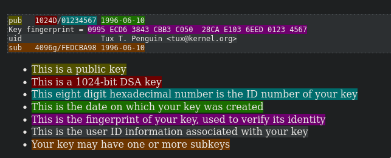
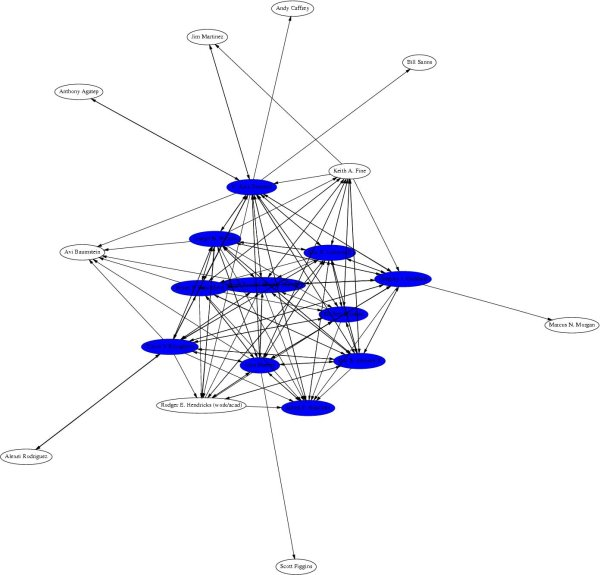

:PROPERTIES:
:ID:       18bfbe2b-1f10-47ab-aaeb-c203bae7ee04
:ROAM_ALIASES: GnuPG GPG
:END:
#+title: PGP

-> [[id:a941c479-da94-455a-8838-c407043d2c26][CYBERSEC サイバーセキュリティ]]

* Testing

+ WHAT IS GPG
+ INSTALL / FLAGS
+ KEY
  - SIGNING A KEY
+ USAGE - SYMMETRIC ENCRYPTION
+ USAGE - ASYMMETRIC ENCRYPTION

BUSINESS CARD
ENGLISH VERSION + JAPANESE VERSION

+ NAME
+ NUMBER
+ EMAIL
+ PGP FINGERPRINT + KEYSERVER
+ SMALL CHECKBOX TO TICK (IF INFORMATION IS VERIFIED)

#+begin_src
FRONT SIDE

BENJAMIN IGNACIO DUNSTAN SILVA
BENJADUNSTAN@GMAIL.COM
2048R/971095FF 2012-12-06
9450 4C3A E11D D197 9200 58AB A90E D7DE 9710 95FF

ed25519 2023-06-20
1903 15A5 2E5C 51F9 CB8D 9790 D00E 4FD7 7420 4FEA
mit.net [KEY SERVER]

BACKSIDE
QR CODE FOR SIGNAL + SIGNAL LOGO (on the center?)
QR CODE FOR LINE + LINE LOGO (on the center?)

github.com/asynthe
mindhackers.net

CHECKBOX AT ONE OF THE SIDES TO CHECK IDENTITY
#+end_src

* RESOURCES

[[https://wiki.archlinux.org/title/GnuPG][arch wiki]]
[[https://wiki.gentoo.org/wiki/GnuPG][gentoo wiki]]

[[https://www.gnupg.org/][gnupg.org]]
[[https://www.openpgp.org/][OpenPGP main page]]

*BOOK*
- [[id:73603336-56ca-40a8-abae-ed0446c3a8c0][PGP & GPG]] by Michael W. Lucas

*TALK*
[[id:04b4d33d-9403-4682-bb9d-caee0765d2c6][A Pretty Good Introduction to Pretty Good Privacy]]

*RESOURCES*
+ [[https://www.redhat.com/sysadmin/getting-started-gpg][Getting started with GPG (GnuPG) - Red Hat]]
+ [[https://www.digitalocean.com/community/tutorials/how-to-use-gpg-to-encrypt-and-sign-messages][How To Use GPG to Encrypt and Sign Messages - DigitalOcean]]
+ [[https://itsfoss.com/gpg-encrypt-files-basic][Using GPG to Encrypt and Decrypt Files on Linux [Hands-on for Beginners] ]]
+ [[https://gock.net/blog/2020/gpg-cheat-sheet][GPG Cheat Sheet - Gock.net]]
+ [[https://www.howtogeek.com/427982/how-to-encrypt-and-decrypt-files-with-gpg-on-linux/][How to Encrypt and Decrypt Files With GPG on Linux - How-To Geek]]
+ [[https://rgoulter.com/blog/posts/programming/2022-06-10-a-visual-explanation-of-gpg-subkeys.html][A Visual Explanation of GPG Subkeys - Richard Goulter's Blog]]

*REVISE / IMPLEMENT*
https://github.com/orhun/gpg-tui
https://blog.orhun.dev/introducing-gpg-tui/
https://www.gpg4win.org/

STACK EXCHANGE QUESTIONS / ANSWERS
[[https://superuser.com/questions/1009623/gpg-tools-location-of-private-keys][GPG Tools: location of private keys - superuser]]
[[https://superuser.com/questions/520980/how-to-force-gpg-to-use-console-mode-pinentry-to-prompt-for-passwords][How to force GPG to use console-mode pinentry to prompt for passwords? - superuser]]
[[https://stackoverflow.com/questions/17769831/how-to-make-gpg-prompt-for-passphrase-on-cli][How to make gpg prompt for passphrase on CLI - StackOverflow]]
[[https://superuser.com/questions/1457167/i-want-to-make-pinentry-use-gui-locally-and-cli-on-ssh][I want to make pinentry use GUI locally and CLI on SSH - superuser]]
[[https://unix.stackexchange.com/questions/671284/gpg-cant-decrypt-no-pinentry-program][GPG can't decrypt: no pinentry program - StackExchange]]
[[https://superuser.com/questions/1676763/import-openpgp-key-on-nixos][Import OpenPGP key (on NixOS) - StackExchange]]

*YOUTUBE*
https://youtu.be/fP0x-YFSh-E
https://youtu.be/ZSa-d_9O5DA
https://youtu.be/lAblt1Qt_ng
https://youtu.be/hffCq7zB8ZA
https://www.youtube.com/watch?v=1vVIpIvboSg
https://www.youtube.com/watch?v=V9-LrXiwGEQ
https://www.youtube.com/watch?v=CEADq-B8KtI
https://www.youtube.com/watch?v=Lq-yKJFHJpk

* WHAT IS GPG?
** PGP, OPENPGP & GNUPG

GPG, or GNU Privacy Guard, is a public key cryptography implementation. This allows for the secure transmission of information between parties and can be used to verify that the origin of a message is genuine.

_ _PGP_: Originally developed by Phil Simmons on mid 90's (check), free as in beer, not as in Stallman.
- _OpenPGP_: Standart, *RFC4880* (defines how a OpenPGP compliant app should work)
- _GnuPG_, "_GNU Privacy Guard_": Free as in beer, and also free in Stallman.
GPG is the GNU implementation of PGP "Pretty Good Privacy".

** WHAT IS PUBLIC KEY ENCRYPTION
from [[https://www.digitalocean.com/community/tutorials/how-to-use-gpg-to-encrypt-and-sign-messages][How To Use GPG to Encrypt and Sign Messages - Digital Ocean]]

A problem that many users face is how to communicate securely and validate the identity of the party they are talking to. Many schemes that attempt to answer this question require, at least at some point, the transfer of a password or other identifying credentials, over an insecure medium.
Ensure That Only the Intended Party Can Read

To get around this issue, GPG relies on a security concept known as public key encryption. The idea is that you can split the encrypting and decrypting stages of the transmission into two separate pieces. That way, you can freely distribute the encrypting portion, as long as you secure the decrypting portion.

This would allow for a one-way message transfer that can be created and encrypted by anyone, but only be decrypted by the designated user (the one with the private decrypting key). If both of the parties create public/private key pairs and give each other their public encrypting keys, they can both encrypt messages to each other.

So in this scenario, each party has their own private key and the other user’s public key.
Validate the Identity of the Sender

Another benefit of this system is that the sender of a message can “sign” the message with their private key. The public key that the receiver has can be used to verify that the signature is actually being sent by the indicated user.

* INSTALL

arch -> ~gnupg~
gentoo -> ~app-crypt/gnupg~
nixos -> ~gnupg~

The default linux package uses GnuPG 2.0 by default, in a installed binary called ~gpg~.
But you may check just in case with ~$ ls -l (which gpg gpg2 gpg1)~

The first time you run any ~gpg~ command, some files will be created on your home directory.
#+begin_src 
gpg: directory '/home/user/.gnupg' created
gpg: keybox '/home/user/.gnupg/pubring.kbx' created
gpg: /home/user/.gnupg/trustdb.gpg: trustdb created
#+end_src

** PINENTRY DAEMON

PINENTRY is the GnuPG's interface to passphrase input.
It's the one that appears when we have to enter the password / passphrase.

pinentry

GUI
pinentry-qt
pinentry-gtk2
pinentry-emacs
pinentry-gnome

CLI
curses

arch -> 
gentoo -> ~app-crypt/pinentry~
nixos -> ~pinentry~
_note_: gentoo: choose with ~# eselect pinentry list~

** OTHER APPS

*GPG-TUI*
nixos -> ~gpg-tui~

*bpb*
[[https://github.com/withoutboats/bpb][github page]]

** FLAGS

~--import~ -> import a key into gpg
~-o~ / ~--output~ -> output into a file
~--fingerprint~ -> check the key fingerprint

SYMMETRIC FILE ENCRYPTION / DECRYPTION
~-c~ / ~--symmetric~ -> encrypt a file
~-d~ / ~--decrypt~ -> decrypt a file
~--no-symkey-cache~ -> skip cached passwords

PUBLIC KEY ENCRYPTION
~-e~ / ~--encrypt~ -> encrypt a file
~-r~ / ~--recipient~ -> recipient the file
~-v~ / ~--verify~ -> verify a signature

* [[id:4f81a52e-4000-4b93-9abc-e30d7920759c][PASS]] 
* USAGE
** SYMMETRIC ENCRYPTION
*** ENCRYPT / DECRYPT A FILE

Just having it installed it's enough to encrypt or decrypt a file with a shared secret.

This is called _symmetric_ encryption.

*ENCRYPT*
You can encrypt a file using symmetric encryption like this:
~$ gpg -c <filename>~ or ~$ gpg --symmetric <filename>~
_note_: Use ~-o~ or ~--output~ to specify a specific output filename.

A file with the same filename, and a ~.gpg~ extension will be created.

*DECRYPT*
Use the decrypt option
~$ gpg -d <filename>.gpg~ or ~$ gpg --decrypt <filename>.gpg~
_note_: GPG will try to use the cached passwords to decrypt, you can use ~--no-symkey-cache~ to skip the cache.

** KEY BASED / ASYMMETRIC ENCRYPTION
*** ENCRYPT A FILE WITH A PUBLIC KEY

Encrypt a file with a public key like this:
_note_: You will have to specify a user ID or email with ~-r~ or ~--recipient~, if not specified, it will ask you anyway.
~$ gpg -e -r <name@email>.com <file>~

You will be shown the key ID and fingerprint to confirm, unless you've already signed the key.

The output will be a file with a ~.gpg~ extension.

*** SIGNING A KEY

Search on the network with:
~$ gpg --search <email>~

Choose the key and edit it with this command:
~$ gpg --edit-key --ask-cert-level <email or pubkey>~
~--ask-cert-level~ -> ask certainty level

*Now*, you will be in _gpg command editor_ (~gpg>~)

~fgr~ -> see the key's fingerprint
(use it to confirm it's the correct key)

Sign the key:
~gpg> sign~

Save the signed key:
~gpg> save~

*** CHECKING A FILE SIGNATURE

To check the *authenticity* of a file, some websites like Fedora provides a CHECKSUM files to verify downloads and it signs those files with the Fedora GPG key.

Import the GPG key, then check the signature like this:
_note_: use the ~-v~ or ~--verify~ option.
~$ gpg -v <file>~

Some files may indicate a "*Good signature*", but will still prompt you to verify the fingerprint. 

_TIP_: *BACKING UP YOUR PGP KEY*
The recommendation is to just backup the entirety of ~.gnupg~, so you can get all the files and the trust database.

_TIP_: GPG PASSWORD INPUT TTL
We don't want to be inputting the password everytime we use something related to GPG, the duration of the password depends on the ~gpg-agent~.

Inside ~~/.gnupg~ there should be a file called ~gpg-agent.conf~, you can edit it so it caches your password for a specific amount of time.

#+begin_src
default-cache-ttl 604800
max-cache-ttl 604800
#+end_src

604800 are the seconds for one-week.
*** SENDING AN EMAIL WITH YOUR PUBLIC KEY
*** SENDING A EMAIL SIGNED MESSAGE

[[https://superuser.com/questions/188493/how-can-i-send-gpg-encrypted-mail-automatically-from-the-linux-command-line][How can I send gpg encrypted mail automatically from the linux command line? - StackExchange]]

* CONFIGURATION
** PUBLIC KEY
*** CREATING A OWN KEY

[[https://www.youtube.com/watch?v=1vVIpIvboSg][Creating and Managing a GPG Key Pair - Nick Janetakis (youtube video)]]

The keys will be created by default in ~~/.gnupg~ unless the environment variable is changed, you can do it like this:
~$ export GNUPGHOME=/tmp/gnupg~
~$ mkdir /tmp/gnupg~

In case of having unsafe permissions warning:
~$ chmod 0700 /tmp/gnupg/~

-----

Generating a key pair
~$ gpg --gen-key~
or
~$ gpg --full-generate-key~
_note_: Setting a expiration date, it's a good idea to set after one year.

List the keys and subkeys on your system
~$ gpg --list-keys~

Publishing a key into the network
~$ gpg --send-key <pub-key>~

*** UPDATING THE EXPIRATION DATE

Once the key get's close to it's expiration date, we can update the key

~$ gpg --edit-key name@email.com~

~gpg> list~ -> check keys
~gpg> key 0~ -> specify key to editw
~gpg> expire~
~gpg> list~ -> check that the key has changed

After changing the expiration date, the modified key will not change until it has been saved and written to disk
~gpg> save~

*** REVOCATION

This will make your key obsolete, it case it has been compromised.

_note_: An update has been made for GPG 2.1 and above, /revocation certificates/ are now created by default.
_note_: Cybersecurity experts don't recommend saving the revocation key along with the gpg key, but this is just a case of security over convenience, just safely storing your gpg key is enough.

Create a revocation key like this
~$ gpg --output revoke-keyexample.asc --gen-revoke user@email.com~

*REVOKING THE KEY*
~$ gpg --import <revocation-key>.asc~

Check that it's has been revoked
~$ gpg --list-keys~

*** PUBLIC KEY EXPORTING

Sign your git commits.

Get the public key in the terminal, copy and paste
~$ gpg --export --armor user@example.com~

--armor -> Exported in text format instead of binary
--output -> Output into a file

~$ gpg --export --armor --output userexample.gpg.pub user@example.com~

*** CHANGING THE PASSPHRASE

It is very simple to change the password, use the next command
~$ gpg --passwd name@email.com~

It will ask you for your current password, then the new one twice.

*** PUBLIC KEY IMPORTING

*SHORT EXPLANATION*
One of the problems with symmetric encryption it's sending secrets over the internet, it can be insecure or not scale well.

Files are encrypted with a _public key_ and it can _only be opened_ with the _private key_ the message is directed to.

But how do you get a _public key_ from someone?

You have to import it.

*IMPORTING*
If the key is provided in a *email* or a *website*, download the file and import it like this:
~$ gpg --import <filename>~

Check the fingerprint, compare it to the one on the website to see if you have the correct key.
~$ gpg --fingerprint~

* TESTING
** SEND GPG ENCRYPTED MAIL

[[https://superuser.com/questions/188493/how-can-i-send-gpg-encrypted-mail-automatically-from-the-linux-command-line][How can I send gpg encrypted mail automatically from the linux command line? - StackExchange]]

Send a ascii-armored, public-key encrypted copy of the file ~filename~ to a person named "Recipient name" (who is your gpg keyring) at email address ~recipient@example.com~ with the specified subject line.

~$ gpg -ea -r "Recipient name" -o - file.txt | mail -s "Subject line" recipient@example.com~
or
~$ echo "Your secret message" | gpg -ea -r "Recipient name" | mail -s "Subject" recipient@example.com~

_note_: add ~s~ to ~-ea~ to sign the message with your private key.

*Other comment: WHEN USING MSMTP*

** SIGNING A MESSAGE / FILE

[[https://stackoverflow.com/questions/57223719/gpg-sign-clear-sign-detach-sign][gpg: --sign, --clear-sign, --detach-sign - StackOverflow]]

There are different flags that will do different things when producing a signature
~--detach-sign~ (or ~-b~) resulting ~.sig~ *won't contain* signed file, just signature
~--sign~ = compresses, signs and output is a binary format
~--clearsign~ = wraps text in a ASCII-armored signature

Differences with ~--clearsign~ and ~--armor --sign~?
With ~--sign --armor~ the cleartext isn't shown, and ascii is different because the armor includes both *message and signature*.
~--clearsign~ is more similar to ~--detach-sign --armor~, ascii shows up after the cleartext.

** SENDING MESSAGE FROM COMMAND-LINE

[[https://superuser.com/questions/188493/how-can-i-send-gpg-encrypted-mail-automatically-from-the-linux-command-line][How can I send gpg encrypted mail automatically from the linux command line? - StackExchange]]

You can use cleartext on your command line or a file

*** Command-line
~$ echo "Test message to sign" | gpg --clearsign --output~

*** File
Do a signature and detach the signature
~$ gpg --detach-sign -o sig.gpg file.txt~
Do a ascii armored cleartext with signature
~$ gpg --clearsign -o signedfile.txt file.txt~

Now, to verify that is a good signature, do it like this
_For a file with the singature inside it_
~$ gpg --verify message.txt~

_For a file with the signature detached_
~$ gpg --verify sig.gpg file.txt~

*** Signed message script

I have a small script that let's me write a message, signs it with my gpg key then copies it to the wayland clipboard.

#+begin_src bash
#!/usr/bin/env bash
# Copy a signed message to the wayland clipboard

echo "Enter message:"
read message

echo "$message" | gpg --clearsign | wl-copy
#+end_src

* EXTRA
* KEY-SIGNING PARTIES
:PROPERTIES:
:ID:       7105e25b-cd39-4e6f-91c5-5a9cd78535fc
:END:

[[https://en.wikipedia.org/wiki/Key_signing_party][wikipedia page]]

*[Move to cryptography?]*

[[https://www.cryptnet.net/fdp/crypto/keysigning_party/en/keysigning_party.html][The Keysigning Party HOWTO]]
[[http://biglumber.com/][Biglumber - key signing coordination]]
[[https://www.flyn.org/notes/signing-party/][GnuPG signing party - Flyn Computing]]
[[http://www.phillylinux.org/keys/terminal.html][Keysigning with the GNU/Linux Terminal - phillylinux.org]]

_A key's fingerprint_
See yours with:
~$ gpg --list-secret-keys --fingerprint~
See all the keys in your keyring with:
~$ gpg --list-keys  --fingerprint~

#+ATTR_ORG: :width 800px

** Visualizing

$ gpg --list-sigs --keyring ~/.gnupg/pubring.gpg | sig2dot > ~/.gnupg/pubring.dot
$ neato -Tps ~/.gnupg/pubring.dot > ~/.gnupg/pubring.ps
$ convert ~/.gnupg/pubring.ps ~/.gnupg/pubring.gif
$ eog ~/.gnupg/pubring.gif

** [[https://carouth.com/articles/signing-pgp-keys/][Signing PGP Keys - carouth.com]]

Two pieces of information to sign a key:
1. Ensuring that the key is the one the person wants me to sign
2. The identity of the person itself, that it identifies with the UID(s) on the key

I proceed in two different ways when signing a key individually and in a party

*Verifying a key individually*
I ask the person to provide me a written or printed copy of:
- The key's _fingerprint_
- ID
- size
- type
- and UID(s)

It's easiest to use the [[https://openpgp.quelltextlich.at/slip.html][OpenPGP key paper slip generator]] and bring the slip with you

I first ask for a government issued ID, driver license card, passport or similar.
Then a second form of identification like a business card from your company, or a conference badge if it was printed there on the conference.

_What if i'm still not convinced?_
I pull a copy of the key from the keyservers, and i check the fingerprint *against the card*.

_The actual process of signing for single and multiple UID keys_
The process is mostly like this for both
1. Import key into keyring
2. Verify fingerprint and details match paper slip
3. Use gpg to sign UID
4. Export signed public key
5. Encrypt exported key for the UID signed
6. Email the encrypted, signed key to the email address associated with the signed UID

*** 1. Importing key into keyring

*KEY WITH SINGLE UIDs*
1. Import the key
   ~$ gpg --import someone@example.com~

2. Now to sign the key
   ~$ gpg --ask-cert-level --sign-key someone@example.com~
   It will ask you if you trust it, then ask you for your passphrase.
   Remember to carefully check the fingerprint and email.
   
3. Check for the signing with
   ~$ gpg --list-sigs someone@example.com~

   #+begin_src
   gpg: checking the trustdb
   gpg: 3 marginal(s) needed, 1 complete(s) needed, PGP trust model
   gpg: depth: 0  valid:   1  signed:   0  trust: 0-, 0q, 0n, 0m, 0f, 1u
   gpg: next trustdb check due at 2015-08-18
   pub   2048R/521A3B7C 2014-03-31 [expires: 2018-03-31]
   uid                  Someone Special <someone@example.com>
   sig 3        521A3B7C 2014-03-31  Someone Special <someone@example.com>
   sig 3        4D8BD439 2014-05-25  Jeff Carouth <jcarouth@gmail.com>
   sub   2048R/EA195394 2014-03-31 [expires: 2018-03-31]
   sig          521A3B7C 2014-03-31  Someone Special <someone@example.com>
   #+end_src

*KEY WITH MULTIPLE UIDs*
In case when you find multiple keys associated or closely related to the key
1. After having the first prompt, it will ask you if you want to sign all user IDs
   Answer this question with *N*, then it will go back to the ~gpg>~ prompt.
   ~gpg>~

2. On this prompt, type the number of the key you want to sign
   ~gpg> 1~
   From here the process will be the same, but it will stay on the ~gpg>~ prompt.
   Use the next command, save then exit.
   ~gpg> save~ (after signing the key)
   ~gpg> exit~

*AFTER SIGNING THE KEYS*
delete the key from your keyring
~$ gpg --delete-key someone@example.com~

*** DISTRIBUTING THE SIGNED KEY

After i signed the private key, i will export it into a *ascii-armored* form

*** RECEIVING A SIGNED KEY

You should be the one that pushes the key into the keyserver.
After receiving the signed key, you must decrypt it.
~$ gpg --decrypt someone_at_example.com.asc.pgp > someone_at_example.com.asc~

You will be left with the ~someone_at_example.com.asc~
Import it into your keychan and pushed to the key server
~$ gpg --import someone_at_example.com.asc~
~$ gpg --send-keys 521A3B7C~

You can update your key file-by-file and send to key server,
Or you can do it all-at-once and send it once.
~$ gpg --decrypt someone_at_example.com.asc.pgp | pgp --import~
~$ gpg --send-keys 521A3B7C~

*** EXPORT SIGNED PUBLIC KEY
** [[https://www.cryptnet.net/fdp/crypto/keysigning_party/en/keysigning_party.html][The Keysigning Party HOWTO - cryptnet.net]]
*** What is the Web of Trust

The web of trust is an identity authentication mechanism.

What the web of trust was meant to do at it's most basic level is provide a reasonable assurance that the person you're in communication with is actually the person that you think you're in communication with.

The Web of Trust is the _sum of all the trust paths_
A trust path is a /link/ or /strand/, this is a _key signature_.
This key signature can be *bi-directional* or *one-way*.

The ideal web of trust is one in which everyone is connected bi-directionally.
It is one that validly links a meatspace identity with a cyberspace identity.

#+ATTR_ORG: :width 700px

*** Generating a Key Pair
~$ gpg --gen-key~

These are some best practice security advice (severe paranoia)
+ The keys are generated with the largest possible keysize to make them more resistant to brute force attack

+ The keys are generated with a limited lifetime to prevent their eventual compromise by advancing computer technology

+ The keys are stored on a usb device to prevent their theft should someone gain access to your computer (remotely or physically)

+ A revocation certificate is generated to allow the public key to be revoked in the event of a compromise or key loss
  
*** Having a Keysigning Policy

Very important, so you have something to guide on and other can see your standards when signing a key.

[[https://cryptnet.net/fdp/crypto/keysigning_party/en/extra/signing_policy.html][example policy]]

*** Signing Keys

1. Get a copy of the key
   The key can be downloaded locally or got through a key server

   For a *key server*, get it like this:
   ~$ gpg --keyserver <keyserver> --recv-keys <key_ID>~
   For a *local key*, import it:
   ~$ gpg --import <file>~

2. Fingerprint and verify key
   ~$ gpg --fingerprint <key_ID>~

   Check the key against the fingerprint against the checklist.
   _note_: Don't check against the one on the web page or online as it may not be the same the same key.

3. Sign the key
   ~$ gpg --sign-key <key_ID>~

   If you have multiple personal _private_ keys, specify which one to use for the signing
   ~$ gpg --default-key <path/to/key> --sign-key <key_ID>~

4. Return or Upload the signed key 

   Be mindful if your the entity approves or doesn't approve of having the key on a public server.

   If working with a keyserver, send it back like this:
   ~$ gpg --keyserver <keyserver> --send-key <key_ID>~

   You should see then a message like this
   #+begin_src
   gpg: success sendint to '<keyserver>' (status=200)
   #+end_src

*** Graphing The Web of Trust

[[https://stackoverflow.com/questions/5835191/visualize-the-gnupg-web-of-trust][visualize the GnuPG web of trust - Stack Overflow]]

~$ gpg --list-sigs | sig2dot.pl > gpg.dot~
~$ dot -Tps gpg.dot > gpg.ps~
~evince gpg.ps~
_note_: You might want to use the ~-a~ option of ~sig2dot~

You will need a _perl script_ that converts the keys and signatures in a keyring to a file in _dot format_.

Download sig2dot.pl and the graphviz software

** GnuPG signing party

[[https://www.flyn.org/notes/signing-party/][GnuPG signing party - Flyn Computing]]

generate key
~$ gpg --full-generate-key~

Obtain key identifier with:
Identifier is composed of 40 hex digits.
~$ gpg --list-secret-keys~

You can add additional email addresses with:
~$ gpg --edit-key <key ID>~ or ~<email>~
~gpg> adduid~
~gpg> save~

Export the key by running
~$ gpg --armor --export <key ID>~ or ~<email>~
This is the key you will be sharing

On the party, confirm the written key is you key by displaying the fingerprint
~$ gpg --fingerprint <key ID>~ or ~<email>~

Import other persons gpg key after receiving it as a file
~$ gpg --import <file>~

Find the person's key, email and ID
~$ gpg --list-keys~

Verify the ID and fingerprint is correct:
~$ gpg --fingerprint <key ID>~
Verbally confirm the fingerprint with it's owner then proceed to sign
~$ gpg --sign-key <key ID>~

** GPG Key-Signing Party - Ralph Bean

http://threebean.org/presentations/gpg/#/step-1

*Visualizing the Web of Trust*
#+begin_src
$ gpg --list-sigs --keyring $GNUPGHOME/pubring.gpg | sig2dot > $GNUPGHOME/pubring.dot
$ neato -Tps $GNUPGHOME/pubring.dot > $GNUPGHOME/pubring.ps
$ convert $GNUPGHOME/pubring.ps $GNUPGHOME/pubring.gif
$ eog $GNUPGHOME/pubring.gif
#+end_src

*Creating a key*
Default options are fine, use a passphrase:
~$ gpg --gen-key~
The default location of the key will be in ~~/.gnupg~

Find your fingerprint
~$ gpg --fingerprint user@example.com~

Upload public key to a keyserver:
~$ gpg --keyserver hkp://subkeys.pgp.net --send-key user@example.com~

*Signing other's keys*
Sit in a oblong circle with each person across from another and pass your identification, tell that person your fingerprint hash, like ~971095FF~

Get their key from the key server or import it
~$ gpg --keyserver hkp://subkeys.pgp.net --recv-keys 971095FF~
Verify the name on the key matches the identification provided, check that fingerprint and everything is correct, then sign key
~$ gpg --sign-key 971095FF~

Send the signed copy back to the keyserver
~$ gpg --keyserver hkp://subkeys.pgp.net --send-key 971095FF~

Import your key with other peoples signatures with:
~$ gpg --keyserver hkp://subkeys.pgp.net --recv-keys <key ID>~

We know that the name belongs to them, but we haven't verified the email.

