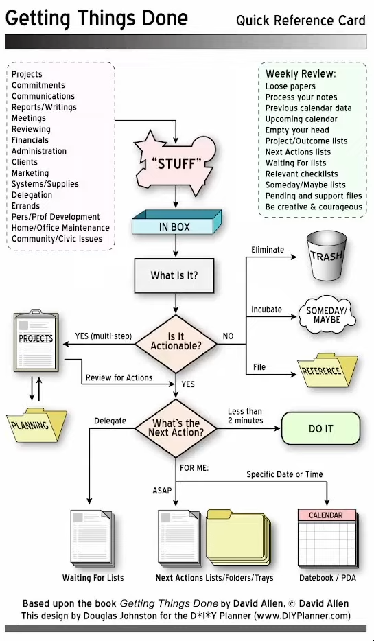

:PROPERTIES:
:ID:       2e03ab25-f856-4646-92ca-08c36c7341cd
:ROAM_ALIASES: "GETTING THINGS DONE OVERVIEW" "gtd overview" "GTD OVERVIEW"
:END:
#+title: Getting Things Done Overview

-> [[id:050e9166-394b-40bb-8135-a45ab4419153][MAIN メイン]] -> [[id:c9156aa2-0d9f-45dd-bf1a-e114e74c13b5][STUDY 勉強]]

You don't want to have creative ideas in a place or time when you can't do them.
This *ideas* will linger in your head, come back randomly and *stress* you out.
If that happens, you certainly _won't be_ very productive.

https://en.wikipedia.org/wiki/Getting_Things_Done
https://gettingthingsdone.com/

[[https://lucidmanager.org/productivity/getting-things-done-with-emacs/][Getting Things Done with Emacs: Manage your life with Org Mode]]
[[https://www.youtube.com/watch?v=YNqFZ4VBppA][Introducing Org GTD v3 - Loki Consulting (youtube video)]]
[[https://emacsconf.org/2020/talks/11/][the org-gtd package: opnitions about Getting Things Done - EmacsConf]]
[[https://orgmode.org/worg/org-gtd-etc.html][Org for GTD and other Task managment systems - Orgmode.org]]

*RESOURCES*
[[https://toggl.com/track/getting-things-done/][Getting Things Done: An Updated Guide to the GTD Method - toggl]]
[[https://todoist.com/productivity-methods/getting-things-done][Getting Things Done (GTD) - todoist]]

* Org Mode GTD Basics - Chris Maiorama

[[https://youtu.be/fFXKiq-LHHM][youtube video]]

** What is GTD?

- /Getting Things Done/ By David Allen
- Systematic approach to productivity and "time management"
  - You cannot manage time but *actions*
- GTD consists of...
  - Calendar
    The hard landscape of your day, week, month.
    Shows you the things you need to get done on a specific date.
    _example_: Party
    
  - *Various lists*
    - *Next actions by context*
      Simple 
      _example_: Pick up a battery from the store.
      
    - *Projects*
      An item or commitment that requires _multiple actions_.
      _example_: Planning my birthday party.
      + I may have to call people
      + I may have to get a cake
      + I may have to schedule and have a certain thing ready
       
    - *"Someday"*
      I can not have this ready today, but i'll put it in a *someday* list, which i'll review once a week or two weeks. You check it once in a while, the idea is to get them _off your mind_.
      _example_: To climb the kilimanjaro.
      
    - *Getting creative*
      You can have this lists in any system you want (Paper system, org mode...)

      One thing that david allen recommends in having a _list of things you're waiting on_. (amazon or stuff like that...)

      You talk to your accountant, and you're waiting for some information, that would also be on a _waiting list_.

      Have different lists for everything that you're doing.

** In this video...

- [ ] Create files
  - [ ] next actions
  - [ ] projects
- [ ] agenda views
  - [ ] calendar
  - [ ] next actions
  - [ ] waiting
  - [ ] complete
  - [ ] ? 

* Introducing Org GTD v3 - Loki Consulting

[[https://youtu.be/YNqFZ4VBppA][youtube video]]

- Everything that comes your way is "stuff"
  You don't what it is until you *process* and *clarify* it.
  
- When you *clarify*, you go through every item and you go through _this diagram_.
  + First: *Is it Actionable?*
    - No
      + It can be _Trash_ (Eliminate)
      + It can be a _Someday/Maybe_ (Incubate)
      + It can be a _Reference_ (File)
    - Yes
      + If it take _multiple steps_, then it's a _Project_.
      + If it doesn't, _Single action_:
        - It takes less than 2 minutes, *Do It Now*.
        - If another person can do it, or you have to wait for another's person action, then put it in _Waiting For_ list.
        - You have to it yourself, then _Next Actions_ Lists/Folders/Trays
        - It has to be done on a specific date or time, then put in to the _Calendar / Datebook / PDA_.

Beyond that you have the *Horizons*, we will talk about those later.

#+HTML: 

** Commands

I will show you the commands then you can modify it yourself.
See the *Org GTD manual* with ~C-h i m org gd RET~.

*** CAPTURE TO THE INBOX
Simply capture with ~M-x org-gtd-capture~

*** PROCESSING THE INBOX
Process with ~M-x org-gtd-process-inbox~

*** ORGANIZING THE INBOX
When processing the inbox, it will say on the top ~M-x org-gtd-organize~

A *Habit* is just an [[id:558134f2-420a-46d5-bc46-70b5df97094e][Org mode habit]].

*** CLARIFYING SIMPLE TASKS / PROJECT

_For a project_
+ Capture the name of the project
+ Now, when processing the inbox, add more steps to the project as second level headings (**), just below the :PROPERTIES:

  #+begin_src org
  ,* buy a house
  :PROPERTIES:
  :ID:         buy-a-house-2023-05-15
  :END:
  ,** find a location you like
  ,** find a realtor
  ,** go through houses
  ,** buy house
  ,** move in
  ,** unpack things
  #+end_src

+ Now you can do ~M-x org-gtd-organize~

*** Org edna

We are going to use a dependency called *org-edna*, enable it like this

#+begin_src elisp
(setq org-edna-use-inheritance t)
(org-edna-mode t)
#+end_src

*** 

* My Get Things Done (GTD) Task Management System Using TaskWarrior

[[https://youtu.be/8I7nQmKAWpM][youtube video]]

What i use:
- Email
- TaskWarrior
- Vit
- Taskel
- Trello

When i'm out of the house, walking around somewhere and i need to capture ideas, i have _two main_ idea capture methods.

1. Email myself, process as quickly as possible. Get and mantain Inbox Zero.
2. If you want to use a GUI, use a Trello board.

If i'm in my _laptop_ i put everything into [[id:51f787d5-6413-4ffb-aacb-e0ba4738c479][Taskwarrior]]

- I want to see this context
- I want to see the active tasks

I use a simple GUI frontend for Taskwarrior called *In The AM*

* TALK: Doing "Getting Things Done" (GTD) with Linux and todotxt - Michigan!/User/Group

[[https://www.youtube.com/watch?v=TtBCh2EWyXY][youtube video]]

Books
- Getting Things Done
- Making It All Work

** What is GTD

- Registered trademark of the David Allen Company.
- Refered to as "Time Management"
- It is a system of "Life Management" and "Focus Management"
- Technology Independent

** Key elements of GTD

- Capture everything that has your attention (inbox)
- Context-based: Filter based on what can you do at this moment
- Next Action list: List of physical actions to complete projects
- Project list: List of "successful outcomes"
- Calendar for "hard landscape" (appointments, day reminders)

*OTHER KEY ELEMENTS OF GTD*
- Waiting-for list (for items that you're waiting for other folks)
- Weekly review: system maintenance
- Horizons of focus (Roles, 1-5 year goals and plans, and life's purpose)
- Someday / Maybe list (items you aren't committed to, but want to remember)

** Single system

- Single system for both work and home
  Having two systems is very complicated, just one is enough

- (Your life is more than just your "work")
- One system to mantain is hard enough
- Allows you to think of work with your other projects / higher levels of focus
- *Don't make a separate work system*

** Brief recap of Five Phases of Work

+ _Capture_ (Collect)

  Collecting all the information that is out there in your life, making sure it's available to you

+ _Clarify_ (Process)

  Figuring out *what is it* and *what to do with it*.

  Writing down this thing (capture) -> What is this that i've writting

+ _Organize_

  Figuring out which bucket to throw it into.

+ _Reflect_ (Review)

  Taking a look through the list and seeing if it has any value.

+ _Engage_ (Do)

  The actual physical action of the work.

** Capturing

+ Any thought you have more than once should be capture
+ _Write it down!_
+ Meaning comes later. For now just dump.

** My Capture Tools

+ Email inboxes (home and work)
+ Genius Scan (Android)
+ Physical inbox
+ (Yes, physical is NOT Optional. :))
+ jml (command-line journaling)
+ Notepads / Moleskine / Fieldnotes (etc)

Why physical?

Here there's a picture of my desk before and after cleaning some stuff.

** Clarifying (Processing)

+ What is it? What's the next action?
+ Two minute rule: If you can finish in less than two minutes, do it.
+ One at a time: no batching
+ Is it actionable? Reference? Trash?
+ Nothing goes back into the in basket

** Virtual Inboxes

+ Downloads folder
+ Dropbox "inbox" folder

todotxt
~$ -S t add Pay Ryan Brodsky\'s bill 123.3 @bill~
  
~$ -S t schedule 179 10/1~

** Inbox Zero

When the inbox gets to zero.

** Organizing

+ No action?
+ Want to Keep it? Reference.
+ Maybe want to do later? Someday / Maybe
+ Don't want / need it? *Throw it out*

MORE ORGANIZATION

+ Actionable?
  + If more than one action, _Project_ list
  + Single action? _Next Action_ list (with context)
  + Day-specific event? _Calendar_
  + Waiting for something to happen? _Waiting for_ List.

** Contexts

+ *Physical location* where you can do something
+ Example contexts
  + @computer
  + @home
  + @calls
  + @agenda
  + @office
  + @errands

 john-topic@agenda

** Reflect (Review)

+ Reviewing lists for next actions and things to check off
+ Review project lists as needed to see what needs updating / completing
+ Reference material for projects
+ Mind sweep (anything that may need capturing)
+ Occasionally: higher altitudes

** Weekly Review: an aside

Thorough cut a few hours of your schedule to actually think about the things you need to do.

Make sure everything's _current_.
That you have next actions for every project that you have.

That all projects are _current_, maybe not *complete* or on the *maybe* list, but _CURRENT_, And the freshest it can posibly get.

*DO IT WEEKLY!*

The reason is _it takes about 7 days for your mind to let things go and stop trusting you're up to date in what you're doing_.

If you do a 14-days or 4-week review, then you're not going to trust your system.

When you stop putting the system on digital/paper and keep it in your mind, you begin to lose focus and things are kept in your head mumbling around.

** Engage (Do)

+ Filter by:
  - Context (what can I do?)
  - Time available (what time do I have available?)
  - Energy (am I alert, or am I toast?)
  - Priority (Do you smell something burning?)

About priority, there will be some times in which you will have to do some things instead of others. Trust your heart, trust your judgment on what needs to be done.

+ *Three-fold nature* of work:
  - Pre-defined Work (_Next action_ lists)
  - Defining your work (know ALL your work)
  - As it shows up (can lead to "busy-trap")

** Key parts of a GTD system

+ Context-based filtering
+ Fast
  
  Drop something in your phone, in a moments notice, as fast as posible.
  
+ Flexible

  Have something *flexible* that works with _the way that you think_ and _the way that you work_.

+ Fun to use

** Todo.txt

[[http://todotxt.org/][main page]]

gentoo -> ~app-misc/todo~
nixos -> ~todo-txt-cli~

+ Context-based filtering

*** Why Todotxt?

- Context-based filtering
- Fast
- Flexible
- Fun to use
- Can be edited with vim (or any text editor)
- Easy to parse with UNIX tools

UNIX is text.

ALSO
- A standardized text file-format for Next Actions
- A collection of applications for interfacing with a todo.txt file
- Cross-platorm (CLI / Android / iOS)
- Developed by Gina Trapani and a dedicated community
- Free Software / Open Source
- Card-carrying Bad Ass Awesome
- (Available at http://todotxt.com)

*** Basic usage

_Adding a record_:

#+begin_src bash
$ todo.sh add Draft up a presentation for GTD at *penguicon @computer
187 Draft up a presentation for GTD at *penguicon @computer
TODO: 187 added.
#+end_src

_Listing based on context_:

#+begin_src bash
$ todo.sh ls @computer
187 Draft up a presentation for GTD at *penguicon @computer
TODO: 1 of 187 tasks shown
#+end_src

_Mark a Next Action as done_:

#+begin_src bash
$ todo.sh do 187
187 x 2015-04-30 Draft up a presentation for GTD at *penguicon @computer
TODO: 187 marked as done.
x 2015-04-30 Draft up a presentation for GTD at *penguicon @computer
TODO: /home/craig/Dropbox/todo/todo.txt archived.
#+end_src

_List context currently in use_: (list contexts)

#+begin_src bash
$ todo.sh lsc
@agenda
@bills
@calls
@computer
@errands
@home
@office
@parents
@read
@waiting
#+end_src

_List on any keyword_:

#+begin_src bash
craig@bluemidget:~$ t ls penguicon
186 Bring in the luggage for Penguicon packing @home
187 Draft up a presentation for GTD at *penguicon @computer
162 Flesh out the slide outline for the GTD under Linux slides for Penguicon
067 Plan for Penguicon 2015 *project
076 Present a GTD under Linux presentation at Penguicon *project
---
TODO: 5 of 187 tasks shown
#+end_src

_Alias_:

#+begin_src bash
alias t='todo.sh'
#+end_src

_Prioritize a next action_:

#+begin_src bash
$ t pri 186 a
186 (A) Bring in the luggage for Penguicon packing @home
TODO: 186 prioritized (A).

$ t ls penguicon
186 (A) Bring in the luggage for Penguicon packing @home
#+end_src

** Getting Things Done: Projects

+ "Outcomes I want to have happen" list
+ Clear statement of what you want to have true when complete:
  + "Garage" - What does "Garage" mean?
  + "Clean garage" - Getting warmer
  + "Clean and organize the garage so I can park the cars in there again" - Much better!

*** Projects under Todotxt

+ Unfortunately, Todotxt doesn't have great project support baked in
+ Limited to ~+project_name~
+ Better served as keywords than a project list
+ (I use a separate ~+project~ project tag for my projects list)

*** Project list best practice

Too lazy to do this ...

#+begin_src bash
$ t add Convert +penguicon slides to Hieroglyph *project
$ t add Edit index.rst to
...
#+end_src

*** Waiting for:

Making a "waiting for" next action:

** Handy Addons

- schedule
- recur
- edit
- More at: https://github.com/ginatrapani/todo.txt-cli/wiki/Todo.sh-Add-on-Directory

** Schedule

...

** note

I'm going to stop here as i may not be using *todotxt*.

Getting an overview of GTD was pretty fun!

** What's the point in all this?

+ Keep things off your mind
+ Be present
+ Know what you need to do
+ Know what you're not doing
  
