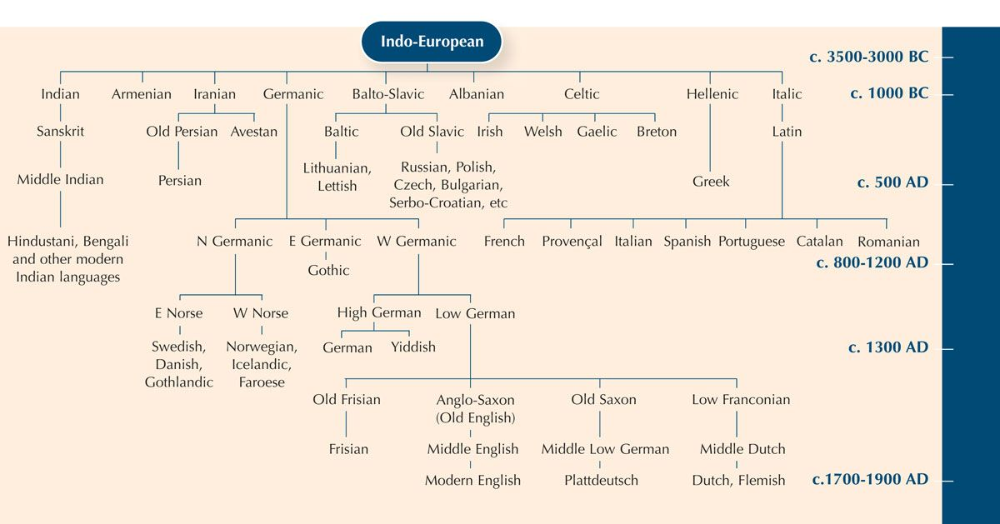

:PROPERTIES:
:ID:       86a0cf3e-51d1-4df5-b63a-b580195431f0
:ROAM_ALIASES: "PHILOSOPHY 哲学" 哲学 PHILOSOPHY
:END:
#+title: Philosophy

-> [[id:c9156aa2-0d9f-45dd-bf1a-e114e74c13b5][STUDY 勉強]]

[[https://ja.wikipedia.org/wiki/%E5%93%B2%E5%AD%A6][哲学 - ja.wikipedia.org]]

* SETUP

Because of lost in translation's

I'm going to read

This is

- German and english books in english (As
- Japanese Books in Japanese (Could read chinese philosophy in japanese?)

#+ATTR_ORG: :width 750px

* BOOKS
* PHILOSOPHERS
** SOCRATES
** PLATO
** ARISTOTELES
** DELEUZE
** FOUCAULT
** DAVID HUME
** JOHN LOCKE
** KANT
** HEIDEGGER
** WITTGESTEIN
** HEGEL
** AQUINAS
** KIERKEGAARD
** HUSSERL
** SARTRE
** DERRIDA
* HISTORY OF PHILOSOPHY
