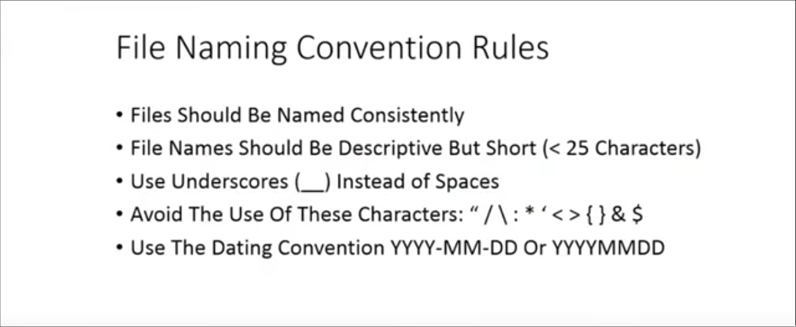

:PROPERTIES:
:ID:       b0d37831-1dcd-47be-ba0b-3bd8a7df063e
:ROAM_ALIASES: リナックス "LINUX リナックス"
:END:
#+title: Linux

-> [[id:050e9166-394b-40bb-8135-a45ab4419153][MAIN メイン]]

* TABLE OF CONTENTS :toc:
- [[#resources][Resources]]
- [[#distros][DISTROS]]
  - [[#android-アンドロイド][ANDROID アンドロイド]]
  - [[#gentoo-ジェンツー][GENTOO ジェンツー]]
  - [[#arch-アーチ][ARCH アーチ]]
  - [[#kali-カーリー][KALI カーリー]]
  - [[#nix][NIX]]
- [[#the-linux-terminal][THE LINUX TERMINAL]]
- [[#shell-scripting][SHELL SCRIPTING]]
- [[#coreutils][COREUTILS]]
- [[#wine][WINE]]
- [[#fonts][FONTS]]
- [[#gtk--qt][GTK / QT]]
- [[#systemd--openrc][SYSTEMD / OPENRC]]
- [[#nvidia-drivers--amd-drivers][NVIDIA DRIVERS / AMD DRIVERS]]
- [[#filesystems--storage--file-sharing-a-guide-to][FILESYSTEMS / STORAGE / FILE SHARING (A GUIDE TO)]]
- [[#extra-fix][EXTRA (FIX)]]
  - [[#dark-mode-switching][dark mode switching]]
  - [[#dpms-screen-management-laptop][DPMS (SCREEN MANAGEMENT, LAPTOP)]]
  - [[#file-naming-conventions][FILE NAMING CONVENTIONS]]
  - [[#the-3-2-1-rule][THE 3-2-1 RULE]]
  - [[#sos-report][SOS REPORT]]
  - [[#gnome---changing-to-dark-theme][GNOME - CHANGING TO DARK THEME]]
  - [[#share-internet-with-a-ethernet-cable][SHARE INTERNET WITH A ETHERNET CABLE]]
  - [[#getting-linux-system-information][GETTING LINUX SYSTEM INFORMATION]]
  - [[#ntfs---linux-fs][NTFS -> LINUX FS]]
  - [[#adding-windows-partition-to-fstab][adding windows partition to fstab]]
  - [[#check-your-cpu-info][check your cpu info]]
  - [[#gnu-radio][GNU RADIO]]
  - [[#wc-word-count][wc (word count)]]
  - [[#hackrf-one][HackRF One]]
- [[#impermanence][Impermanence]]
- [[#curl][cURL]]
- [[#enumerating-a-linux-system][ENUMERATING A LINUX SYSTEM]]
  - [[#operating-system][Operating System]]
  - [[#applications-and-services][Applications and Services]]
  - [[#communications-and-networking][Communications and Networking]]
  - [[#confidential-information-and-users][Confidential Information and Users]]
  - [[#file-systems][File Systems]]
  - [[#next-steps][Next Steps]]

* Resources

[[https://www.gnu.org/gnu/thegnuproject.html][The GNU Project by Richard Stallman - GNU.org]]

*USEFUL*
+ [[https://paint.js.org/][paint.js]]
+ [[https://github.com/open-sdr/openwifi][Openwifi - github]] -> Make into a note
https://github.com/chubin/cheat.sh
https://cheat.sh/

NEWS
+ [[https://www.stackscale.com/blog/most-powerful-supercomputers-linux/][The 500 most powerful supercomputers use Linux - Stackscale]]

https://www.reddit.com/r/linux/comments/dm7w0/what_would_you_consider_to_be_essential_linux_apps/

* DISTROS
** [[id:7e52c960-b6f9-4c1d-8b4d-aba03fa899fc][ANDROID アンドロイド]]
** [[id:98f94da7-e51a-46f5-99c1-02a478624f8c][GENTOO ジェンツー]]
** [[id:e2d675a4-a47c-48b4-af5f-0842aa62618e][ARCH アーチ]]
** [[id:012bd2a5-d0f0-4b34-911c-03bfee59e8be][KALI カーリー]]
** [[id:b9e94588-3066-473f-a0ad-c0a266a46423][NIX]]
* THE [[id:fed24c43-e1fd-47cd-ba74-9fce08d6d8d9][LINUX TERMINAL]]
* [[id:fcf0c804-9e84-4948-a9cf-ea92eef235f5][SHELL SCRIPTING]]
* [[id:4333edba-c592-43e5-999a-bb141fb79ccf][COREUTILS]]
* [[id:95152727-d7c3-4142-b26a-2ccb243d0dd9][WINE]]
* [[id:f7cb03c9-a09b-4650-88bb-509ac4f5b11e][FONTS]]
* [[id:2a79f3c2-4e51-4c75-88c5-b74548ed1331][GTK / QT]]
* [[id:56735aa9-4477-4a6b-8251-c65c4f47d2c4][SYSTEMD]] / [[id:8a944b1c-e100-466e-988c-13163424128a][OPENRC]]
* [[id:01cd68ce-071e-4c95-ac48-ca4330186562][NVIDIA]] DRIVERS / AMD DRIVERS 
* [[id:18e2483e-8a47-40d7-9a80-a79a3ca254fb][FILESYSTEMS]] / [[id:ef5bd774-e428-452d-9e04-1dad211148d3][STORAGE]] / [[id:d1093c5b-1817-4713-93d6-83fdf6377ee7][FILE SHARING]] (A GUIDE TO)
* EXTRA (FIX)
** dark mode switching

[[https://wiki.archlinux.org/title/Dark_mode_switching][Dark mode switching - arch wiki]]

*NIXOS*

** DPMS (SCREEN MANAGEMENT, LAPTOP)

[[https://wiki.archlinux.org/title/Display_Power_Management_Signaling][arch wiki]]

** FILE NAMING CONVENTIONS
:PROPERTIES:
:ID:       c05cb140-ea5c-410a-8805-4a07e73ba426
:ROAM_ALIASES: "File Naming Conventions"
:END:

[[https://youtu.be/zIp6yFgn3d4][youtube video]]

*How to adopt a file naming convention?*
Figure out a group of related files that need a file naming convention.

Figure out 3 things that can make you _recognize_ what's inside of them just by _looking_.

- Date
- Where you've collected the data from
- Who collected the data
- Particular type of analysis that is being done
- Sample number or ID

After choosing those 3 names, you want to also have a template for the filename.

#+ATTR_ORG: :width 800

The Dating Convention is following the dating convention "ISO 8601"
- 4-digit-year
- 2-digit-month
- 2-digit-name

A _example_ of a file name convention: *journal articles*
- ~Akin_2009_TheEffectOfUVLightonZebraFish~
- ~Beryl_1997_HowChemistsManageTheirData~
- ~Gobel_2003_ObservationsOfMustelaErminea~
- ~Smith_2012_SynthesisOfCoSiNanowires~
- ~Yeats_2014_VictorianDeathRituals~

Remember to write you file naming convention in a _research notebook_ or a _readme.txt_ along with the files so you know and your co-worker can also manage your data.

** THE 3-2-1 RULE
** SOS REPORT

[[https://access.redhat.com/solutions/3592][What is an sos report and how to create one in Red Hat Enterprise Linux - Red Hat Customer Portal]]
[[https://access.redhat.com/documentation/en-us/red_hat_enterprise_linux/8/html/generating_sos_reports_for_technical_support/generating-an-sos-report-for-technical-support_generating-sos-reports-for-technical-support][Chapter 1. Generating a sos report for technical support - Red Hat Customer Portal]]

The sos report command is a tool that collects _configuration details_, _system information_ and _diagnostic information_ from a Red Hat Enterprise Linux system. For instance: the _running kernel version_, _loaded modules_, and _system and service configuration files_. The command also runs external programs to collect further information, and stores this output in the resulting archive.

The output of sos report is the common starting point for Red Hat support engineers when performing an initial analysis of a service request for a Red Hat Enterprise Linux system.

*** package

arch ->
gentoo ->
nixos -> sosreport xsos

*** usage

/var/tmp

sosreport

sosreport -l

** GNOME - CHANGING TO DARK THEME

To change to ~Adwaita-dark~ (dark mode), run the next commands:
~$ gsettings set org.gnome.desktop.interface gtk-theme Adwaita-dark~
~$ gsettings set org.gnome.desktop.interface color-scheme prefer-dark~

To set it to ~Adwaita~ (light mode), run the next commands:
~$ gsettings set org.gnome.desktop.interface gtk-theme Adwaita~
~$ gsettings set org.gnome.desktop.interface color-scheme prefer-light~

** SHARE INTERNET WITH A ETHERNET CABLE

Go to network manager, and add a ~Ethernet~ connection.
Edit this connection ~IPv4 CONFIGURATION~, change it to ~<Shared>~.

This should automatically enable internet on the other computer. Check the internet connection by doing a ping:
~$ ping 1.1.1.1~

** GETTING LINUX SYSTEM INFORMATION

linux kernel version
~$ uname -r~

linux information + date + arc
~$ uname -a~

** NTFS -> LINUX FS

~$ chmod * 664~

** adding windows partition to fstab

first, check you have ~ntfs-3g~ installed.

use ~$ blkid | grep ntfs~ and write your Windows device UUID.
should be something like this: _DCCA25DFCA25B724_

now, edit ~/etc/fstab~ to add your new mounting point:
#+begin_src fstab
UUID=DCCA25DFCA25B724 /home/asynthe/windows ntfs-3g defaults 0 0
#+end_src

finally, create the folder for your Windows, it's like magic.
~$ mkdir ~/windows~
It should work on your next restart.

_In NixOS_

add the next configuration to your ~/etc/configuration.nix~

#+begin_src nix
fileSystems."/home/asynthe/windows" = {
  device = "/dev/nvme0n1p2";
  fsType = "ntfs";
};
#+end_src

** check your cpu info

use lscpu
~$ lscpu~

** GNU RADIO

https://en.wikipedia.org/wiki/GNU_Radio
https://github.com/gnuradio/gnuradio

** wc (word count)
** HackRF One

https://en.wikipedia.org/wiki/HackRF_One

* Impermanence

Having the root folder as tmpfs (impermanence)

* [[id:83b80c1d-b1b0-4287-9f99-dde1c26e4480][cURL]]
* ENUMERATING A LINUX SYSTEM

[[https://cyberlab.pacific.edu/resources/linux-enumeration-cheat-sheet][Linux Enumeration Cheat Sheet - University of the Pacific]]

After gaining shell access to a system, you may want to identify and perform some common task to better understand the system and it's installed software, users and files.
This is refered to as _System Enumeration_.

** Operating System

What distribution and version is used?
#+begin_src bash
$ cat /etc/issue
$ cat /etc/*-release
$ cat /etc/lsb-release
$ cat /etc/redhat-release
#+end_src

What is the Kernel version? Is it 64-bit?
#+begin_src bash
$ cat /proc/version
$ uname -a
$ uname -mrs
$ rpm -q kernel
$ dmesg | grep Linux
#+end_src

What can be learned from the environmental variables?
#+begin_src bash
$ env
$ set
$ cat /etc/profile
$ cat /etc/bashrc
$ cat /etc/.bash_profile
$ cat /etc/profile
$ cat /etc/profile
$ cat /etc/profile
#+end_src

** Applications and Services
_note for me_:
- add systemd commands
- add other distros package listing commands

What services are running? And what users are they running as?
#+begin_src bash
$ ps aux
$ ps -elf
$ top (or htop)
$ cat /etc/service
#+end_src

Which service(s) are running as root? Of these services, which are vulnerable?
#+begin_src bash
$ ps aux | grep root
$ ps -elf | grep root
#+end_src

What applications are installed? What version are they? Are they currently running?
+ Ubuntu or Debian-based
#+begin_src bash
$ dpkg -l
$ dpkg -l PACKAGE-NAME
$ rpm -qa
#+end_src
+ Arch
  ...
+ Gentoo
  ...
+ NixOS
  ...

What jobs are scheduled?
systemd Services and Timers
#+begin_src bash
...
#+end_src

Cron
#+begin_src bash
$ crontab -l
$ cat /etc/cron*
$ cat /etc/cron.d/*
$ cat /etc/cron.daily/*
$ cat /etc/cron.hourly/*
$ cat /etc/cron.monthly/*
$ cat /etc/crontab
$ cat /etc/at.allow
$ cat /etc/at.deny
$ cat /etc/anacrontab
#+end_src

** Communications and Networking

What NIC(s) does the system have? Is it connected to another network?
#+begin_src bash
$ ifconfig
$ ip link
$ ip addr
$ /sbin/ifconfig -a
$ cat /etc/network/interfaces
$ cat /etc/sysconfig/network
#+end_src

What are the network configuration settings? What can you find out about this network? DHCP server? DNS server? Gateway? Firewall rules?
#+begin_src bash
$ cat /etc/resolv.conf
$ cat /etc/sysconfig/network
$ cat /etc/networks
$ iptables -L
$ hostname
$ dnsdomainname
#+end_src

What other users & hosts are communicating with this system?
#+begin_src bash
$ lsof -i
$ lsof -i :80
$ netstat -antup
$ netstat -antpx
$ netstat -tulpn
$ chkconfig --list
$ chkconfig --list | grep 3:on
$ last
$ w
#+end_src

** Confidential Information and Users

Who are you? Who is logged in now? Who has been logged in previously? Who else is there? Who can do what?
#+begin_src bash
$ id
$ who
$ w
$ last
$ cat /etc/passwd    # List of users
$ cat /etc/sudoers
$ sudo -l
#+end_src

What sensitive files can be found?
#+begin_src bash
$ cat /etc/passwd    # User accounts
$ cat /etc/group     # Groups
$ cat /etc/shadow    # Password hashes
#+end_src

Is anything "interesting" in the home directories? Do you have access?
#+begin_src bash
$ ls -ahlR /root/
$ ls -ahlR /home/
#+end_src

Are there any passwords in scripts, databases, configuration files or log files? The specific files to search will depend on the installed programs determined previously...
#+begin_src bash
$ cat /var/apache2/config.inc
$ cat /var/lib/mysql/mysql/user.MYD
$ cat /root/anaconda-ks.cfg
#+end_src

What has the user being doing? Are there any password in plain text? What have they been editing?
#+begin_src bash
$ cat ~/.bash_history
$ cat ~/.zsh_history
$ cat ~/.nano_history
$ cat ~/.atftp_history
$ cat ~/.mysql_history
$ cat ~/.php_history
#+end_src

Are there any private keys accessible?
#+begin_src bash
cat ~/.ssh/*
#+end_src
_note_: Check other user directories too!

** File Systems

How are file-systems mounted?
#+begin_src bash
$ mount
$ df -h
#+end_src

Are there any unmounted file-systems?
#+begin_src bash
$ cat /etc/fstab
#+end_src

Find world writable folders and files:
#+begin_src bash
$ find / -xdev -type d -perm -0002 -ls 2> /dev/null
$ find / -xdev -type f -perm -0002 -ls 2> /dev/null
#+end_src

Find SUIDs (files & programs that have the permission of their owner -- usually root. Useful for privilege escalation)
#+begin_src bash
$ find / -perm -4000 -user root -exec ls -ld {} \; 2> /dev/null
#+end_src

** Next Steps

What development tools/languages are installed/supported?
#+begin_src bash
$ which perl
$ which python
$ which python3
$ which gcc
# Can look for binaries not in search path
# find / -name perl*
# find / -name python*
# find / -name gcc*
# find / -name cc
#+end_src

How can files be downloaded to this system?
#+begin_src bash
$ which wget
$ which nc
$ which netcat
#+end_src
Look for binaries not in search path
#+begin_src bash
$ find / -name wget
$ find / -name nc*
$ find / -name netcat*
#+end_src
